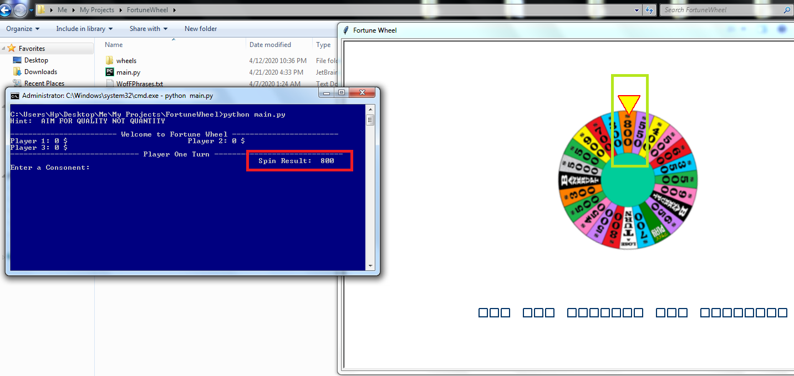

# FortuneWheel
This is a Fortune Wheel game written in python-turtle, but the wheel actually spins in this program and extracts the random spin value using code.

## Setup
 - Step1: after download, cd to this folder and run "pip install requirements.txt".
 - Step2: after requirements are satisfied run "python main.py".

## Agenda
  The main purpose of this code is to actually show how you can rotate a wheel and extract its spin value.

## Here is screenshot where the cosole is showing the same result as the wheel pointer.

If any queries you can ask me i will try to reply as soon as possible!
